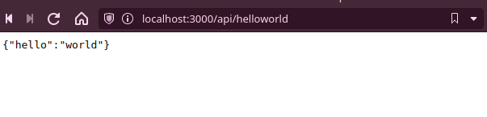

# DIRECTIONS

original site: https://github.com/robtweed/qewd

1. clone this repo
2. pull docker image `docker pull rtweed/qewd-server-rpi`
3. navigate into repo dir in terminal
4. get the dir path with `pwd` command
5. replace the path in the command below after the -v flag and run it in terminal 
`docker run -it --name qewdup --rm -p 3000:8080 -v /home/zuwa/Projects/myQEWDApp/:/opt/qewd/mapped rtweed/qewd-server`

** don't forget the trailing slash `/` **

## Result

Test URL: http://localhost:3000/api/helloworld

Screenshot: 



```json
{"hello":"world"}
```
